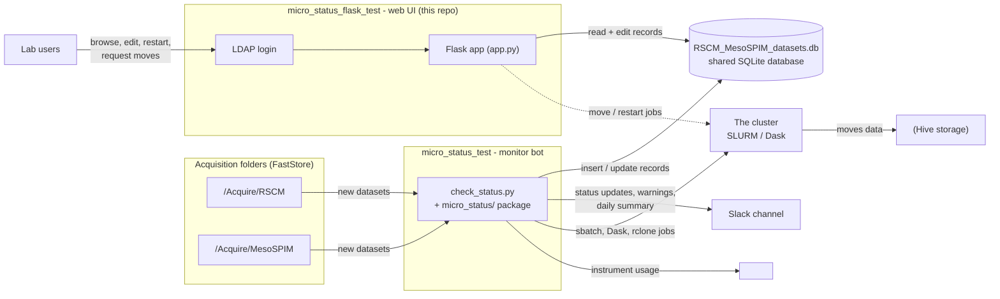

# micro_status_flask_test — dataset web interface

Authenticated Flask web app for monitoring acquisition and processing of **RSCM** and
**MesoSPIM** datasets. It works with the SQLite database populated and maintained by the
RSCM/MesoSPIM slack bot ([`micro_status_test`](../micro_status_test/)) — the same file,
viewed and edited through a browser.

This is one half of a two-part system; the monitoring bot is the other half — see
[Related project](#related-project-micro_status_test).

> **Paths and hosts in this document** are deployment-specific placeholders:
> `<FS_ROOT>` = FastStore data root · `<HIVE_ROOT>` = Hive data root ·
> `<LOGIN_NODE>` = lab login node · `<SCHEDULER_HOST>` = online scheduler host ·
> `<USER>` = lab account name.
> Actual values live in `micro_status_flask/settings.py` (and the app config) on the server.

## How the two projects fit together



The **shared SQLite database is the contract between the two projects**:

- the bot inserts datasets and continuously updates statuses, progress counters and flags;
- this web app lets authenticated lab members browse and edit the same records;
- edits made here (e.g. `paused`, `keep_composites`, restarts, move requests) are picked
  up by the bot on its next scan.

## Features

| Route | What it does |
|---|---|
| `/` | Dashboard: Dataset table filtered by time (`week` / `month` / `year`) and PI. Non-admin users automatically see only their own PI's datasets; the admin account (role ID defined in code) can filter by any PI. |
| `/datasets` | Full dataset list (currently not login-protected). |
| `/datasets/<id>/edit` | Edit a record (WTForms with a PI dropdown). Deletion is not supported. |
| `/datasets/new` | Create a new record (sets the `created` timestamp). |
| `/datasets/<id>/restart` | Restart processing. MesoSPIM: submits `mesospim_utils` (`automated.py`) as a SLURM job (zarr input, `ims` final file). RSCM: writes a stitch-queue file under `RSCM_FOLDER_STITCHING/queueStitch`. |
| `/datasets/<id>/move` | Move a dataset to `<HIVE_ROOT>`: generates an sbatch script (`rclone copy` → `rclone check` → source to trash, with complete/error markers) under `<FS_ROOT>/tmp/move_jobs`, submits it, sets `moving=1`. |
| `/login`, `/logout`, `/profile` | LDAP authentication (see below). |

## Authentication

- LDAP via `ldap3` (NTLM) against the institute's Windows domain
  (`ldap://<domain_server>:<domain_port>`).
- `flask_login` session management; the login route is rate-limited (`flask_limiter`).
- The logged-in username is matched against the `pi` table: lab members see that lab's
  datasets; the admin account (role ID defined in code) sees and can filter everything.
- A `bypass_auth` option exists in the auth config for testing only.

## Repository layout

| Path | Purpose |
|---|---|
| `micro_status_flask/app.py` | Flask app, routes, DB config, move/restart job generation |
| `micro_status_flask/auth.py` | Login manager, LDAP auth, login/logout/profile routes, rate limiting |
| `micro_status_flask/models.py` | SQLAlchemy models (`Dataset`, `PI`, `CLNumber`) mapping the existing schema |
| `micro_status_flask/forms.py` | WTForms definitions (`DatasetForm`) |
| `micro_status_flask/settings.py` | Paths shared with the bot (DB location, storage folders, move-jobs dir) |
| `micro_status_flask/templates/` | Jinja templates |
| `micro_status_flask/data.db` | Stale local artifact — the real DB is at `<FS_ROOT>/RSCM_MesoSPIM_datasets.db` |

## Database

- The app points at the same shared database as the bot:
  `sqlite:////<FS_ROOT>/RSCM_MesoSPIM_datasets.db` (`SQLALCHEMY_DATABASE_URI`
  in `app.py`); some helpers also use `settings.DB_LOCATION` directly via `sqlite3`.
- The SQLAlchemy models map onto the schema created and maintained by the bot — **do not
  rename tables or columns**, and keep form fields aligned with model attributes so
  `form.populate_obj(...)` keeps working.
- Status vocabularies written by the bot: `imaging_status` = `in_progress` / `paused` /
  `finished`; `processing_status` = `not_started` / `started` / `stitched` /
  `moved_to_hive` / `denoised` / `built_ims` / `finished`.

## Setup & run (login node)

```bash
ssh <USER>@<LOGIN_NODE>
conda activate microstatus-flask
cd micro_status_flask/micro_status_flask   # run from inside micro_status_flask/
python app.py
```

The app is then available at **http://<LOGIN_NODE>:1414**.

Notes:

- Start from **inside** `micro_status_flask/`: `app.py` imports sibling modules
  (`settings`, `auth`, `models`, `forms`) as top-level modules.
- Dependencies (no `requirements.txt` is tracked): Flask, Flask-SQLAlchemy,
  Flask-Login, Flask-WTF/WTForms, ldap3, flask-limiter, plus `flask_file_browser`
  (used for the auth config, below).
- `python3 -m compileall micro_status_flask` is the safe syntax check.

## External auth config

`setup_auth()` in `auth.py` reads an INI-style config file via
`flask_file_browser.routes.settings` (lives outside this repo). Expected sections/keys:

| Section | Keys |
|---|---|
| `[auth]` | `secret_key`, `login_limit`, `bypass_auth`, `domain_server`, `domain_port`, `domain_name` |
| `[app]` | `name` |
| `[GA4]` | `gtag` |

## Caveats & warnings

- `app.py` runs with `debug=True` on `0.0.0.0:1414`.
- Mutating routes (edit, create, restart, move) are `@login_required`, but `/datasets`
  currently is not.
- Edits write to the **live** database — the bot picks up changes on its next scan.
- `data.db` in the repo is a local artifact; the real database is external.

## Related project: micro_status_test

[`micro_status_test`](../micro_status_test/) is the monitoring bot that populates this
app's database: it discovers datasets in the acquisition folders, tracks imaging and
processing progress, posts Slack updates and warnings, submits cluster work and moves
data to `<HIVE_ROOT>`. Without the bot this app just shows an empty (or stale) database — see
the diagram at the top.
